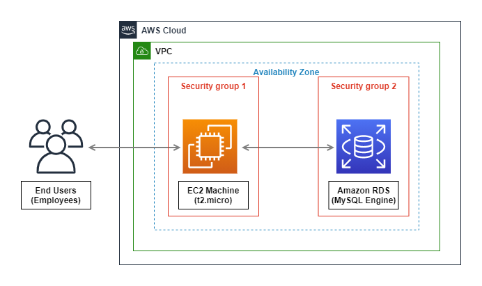
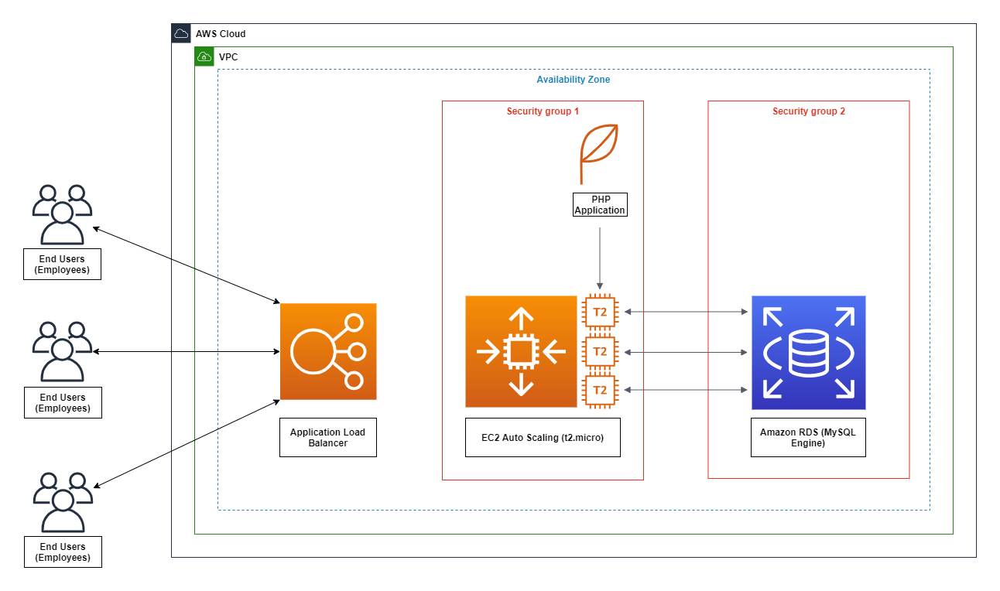
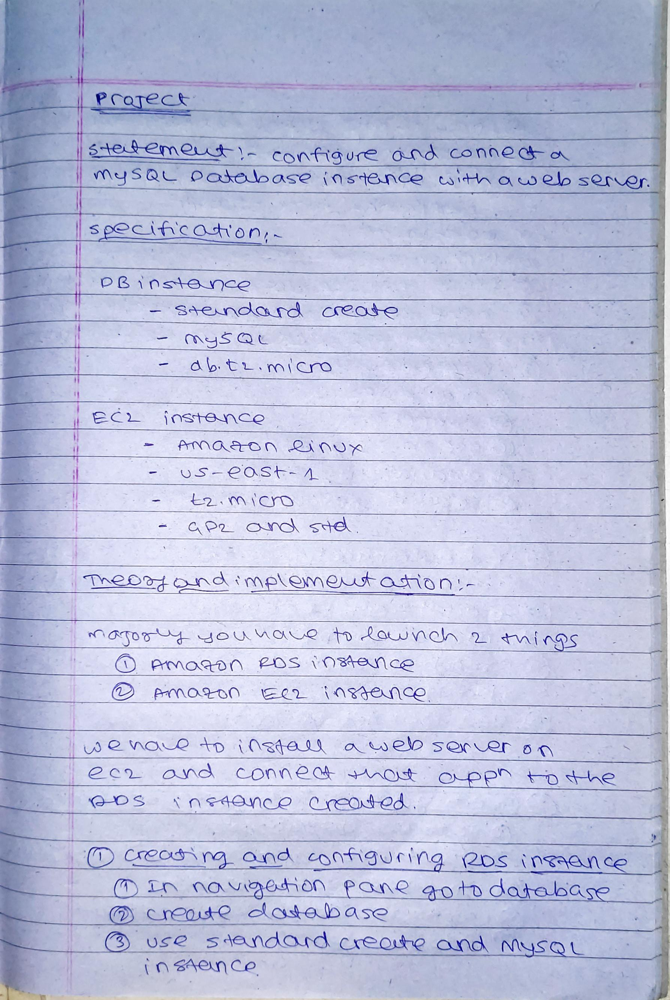
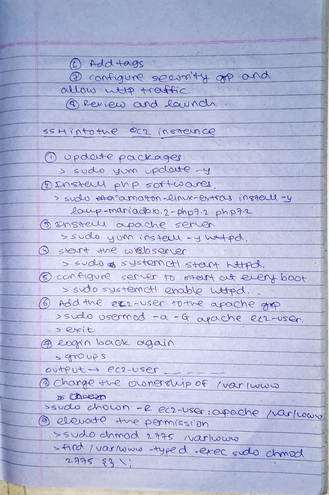
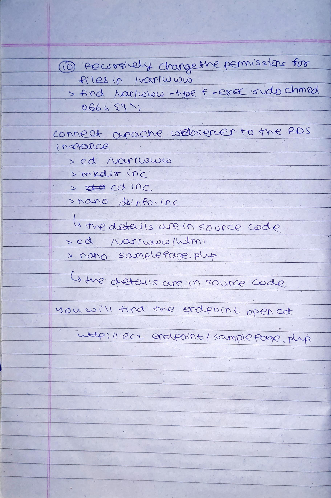

## **Project**

#### **Problem Statement**
***
Configure and Connect a MySQL Database Instance with a Web Server

#### **Description**
***
You are working as a database administrator for an IT firm. You have been asked to create a new database instance on AWS cloud and connect it with the employee management portal hosted on a web server.

#### **Background of the problem statement:** 
***
Your organization wants to deploy a new multi-tier application. The application will take live inputs from the employees and it will be hosted on a web server running on the AWS cloud. 

The development team has asked you to set up the web server and configure it to scale automatically in cases of a traffic surge, to make the application highly available. They have also asked you to take the inputs from the employees and store them securely in the database

#### **Specifications**
***
Create a Database Instance with the following specifications: 

Database creation method: Standard Create 
Engine: MySQL 
Database Instance size: db.t2.micro 

 

Create an EC2 Instance with the following specifications: 

AMI: Amazon Linux  
Region: Use only US East (N Virginia), us-east-1, and us-east-2 
Instance types: t2.micro and t3.micro 
Allowed EBS types: GP2 and Standard 

## Architecture Diagram
### Level 1
***

***
### Can be Upgraded accordingly - Level 2
***

***

#### **Writeup**
***

***

***

***

***

